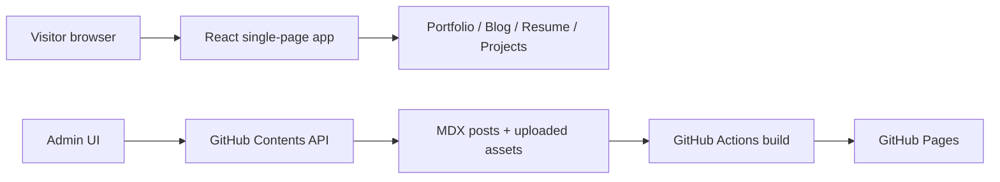

# Personal Site And Blog Publisher

This repo powers my personal website: portfolio, resume, writing archive, photo
notes, and a lightweight MDX publishing workflow backed by GitHub.

## Status

Active personal site deployed with GitHub Pages. The app is also a small content
management experiment: an admin UI can create MDX posts and upload assets by
committing directly to this repo through the GitHub Contents API.

## What It Does

- Portfolio homepage and project cards
- Resume and contact pages
- MDX blog with custom components for figures, callouts, and media
- Photo-of-the-month and art/archive views
- Admin UI for publishing posts and uploads
- Explicit image optimization command for checked-in media
- GitHub Actions deployment to GitHub Pages

## Architecture



## Stack

- React 19 and React Router 7
- MDX for posts
- Webpack 5 build pipeline
- Sharp image optimization
- GitHub Actions and GitHub Pages
- GitHub Contents API for admin publishing

## Local Development

Install dependencies:

```bash
npm install
```

Start the dev server:

```bash
npm start
```

Build production assets:

```bash
npm run build
```

To optimize tracked image assets before committing them, run:

```bash
npm run optimize:images
```

GitHub Pages runs this same optimization step before each production build, so
new repository-backed uploads are optimized even when local optimization was skipped.

The build script also writes `dist/404.html` so GitHub Pages can serve deep
links for the single-page app.

## Editing Content

Blog posts live in:

```text
src/blog/posts/
```

Posts are MDX files with YAML frontmatter. Useful components include:

```mdx
<Figure src="/assets/uploads/my-photo.jpg" alt="Description" caption="Caption" />
<Callout title="Note" variant="teal">Text here</Callout>
<video controls src="/assets/uploads/my-video.mp4" />
```

## Admin Publishing

Open `/admin` on the deployed site. The admin UI uses a fine-grained GitHub PAT
held only for the current browser session to commit new posts and uploaded assets to `main`.
Because this is a static GitHub Pages site, use a token scoped only to this repository and
clear it when finished.

Required token permission:

```text
Repository contents: Read and write
```

Publishing flow:

1. Draft post or upload asset in the admin UI.
2. Admin UI commits to the repo through GitHub.
3. GitHub Actions builds the site.
4. GitHub Pages serves the updated static bundle.

## Deployment

1. Push to `main`.
2. GitHub Actions runs `.github/workflows/pages.yml`.
3. The generated `dist/` output is deployed to GitHub Pages.

## Design Notes

The site is intentionally simple: static hosting for public pages, MDX for
portable writing, and GitHub as the content backend. The admin UI is not a full
CMS; it is a focused workflow for editing a personal site without introducing a
database or separate service.

## License

MIT
